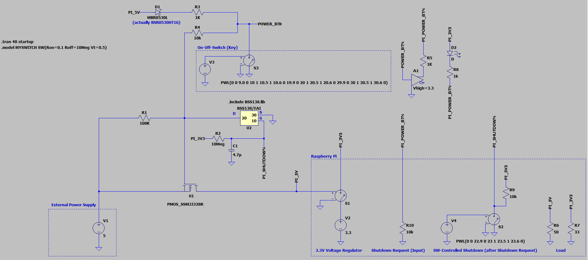
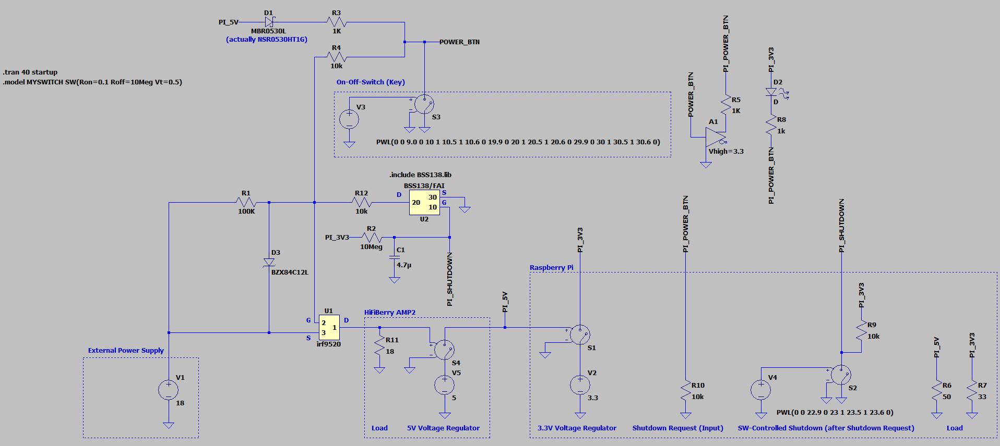
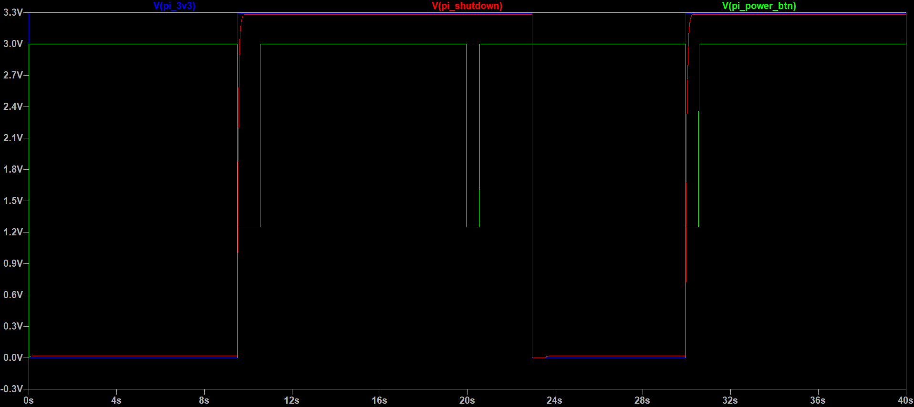

# On-Off-Shim Simulation and Extension for Supply Voltage >5V

Two [LTspice XVII](https://www.analog.com/en/design-center/design-tools-and-calculators/ltspice-simulator.html) setups are provided:
1. Starting from the schematic provided in https://github.com/pimoroni/clean-shutdown/issues/18#issuecomment-456816943, the original circuit was modeled.
2. The circuit was modified to use an 18V supply with an additional 5V voltage regulator. The modification is targeted to the [HifiBerry Amp2](https://www.hifiberry.com/shop/boards/hifiberry-amp2/) Class D Audio Power Amplifier (with integrated 5V regulator for the Raspberry Pi), but could be used in other cases where a supply voltage >5V needs to be switched.

The [BSS138 N-Channel Logic Level Enhancement Mode MOSFET simulation model](BSS138.lib) was downloaded from [onsemi's website](https://www.onsemi.com/design/resources/design-resources/models?rpn=BSS138).

The [IRF9520 P-Channel Power MOSFET simulation model](sihf9520.lib) was downloaded from [Vishay's website](https://www.vishay.com/mosfets/list/product-91074/).

With those models, schematic symbols can be created as follows:
1. open \*.lib file in LTspice
2. mark line containing a `.SUBCKT` direktive
3. right-click and choose `Create Symbol` from context menu
4. add required component from `AutoGenerated` folder to schematic

## On-Off-Shim Simulation

[On-Off-Shim LTspice schematic](onoff_shim_schematic.asc)

* on-off push button: voltage controlled switch (S3) controlled by supply V3 configured with piecewise-linear sequence; switched on for 0.5s at t=[10, 20, 30]s
* Raspberry's on-board 3.3V regulator: voltage supply V2 and voltage controlled switch S1
* Raspberry's shutdown request GPIO (input): R10 (just for modeling an input port to the Raspberry Pi block)
* Raspberry's SW-controlled shutdown GPIO (output): voltage controlled switch S2 and voltage supply V4; switched on (logically 3s after shutdown request) for 0.5s at t=23s
* load at 5V and 3.3V supply: R6 and R7

## On-Off-Shim >5V Supply Voltage Extension Simulation

[Extended On-Off-Shim with IRF9520 LTspice schematic](onoff_shim_irf9520_schematic.asc)

Changes to the previous schematic:
* 18V instead of 5V supply (V1)
* U1 changed to [IRF9520](https://www.vishay.com/mosfets/list/product-91074/) power MOSFET
* 5V voltage regulator (on HiFiBerry Amp2 board): V5 and S4
* load at 18V supply: R11
* U1 V_GS voltage clamp (IRF9520 is limited to 20V): 12V zener diode D3
* current limiter for D3: R12

